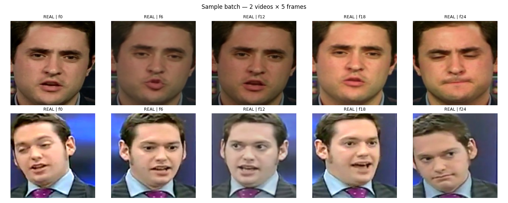
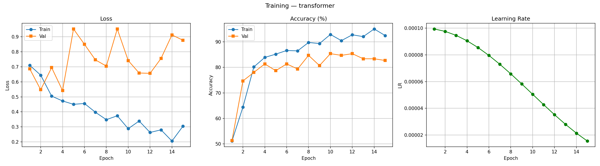
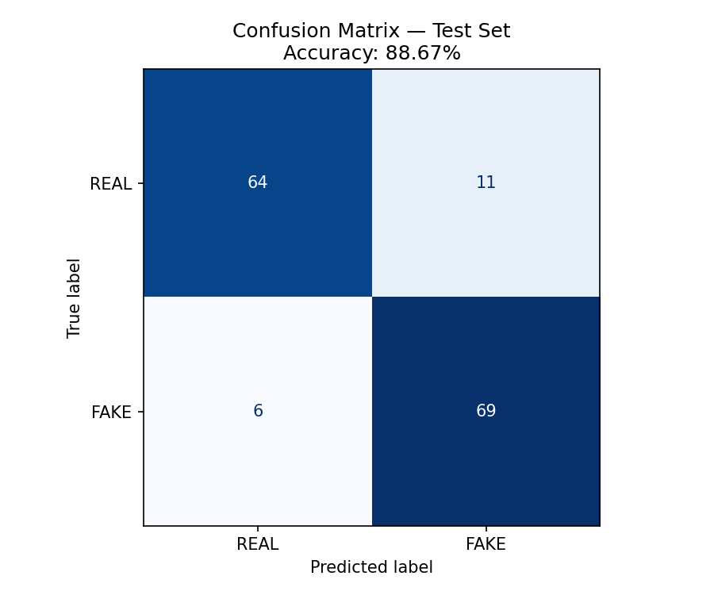

# Deepfake_Detection_using_DeepLearning (EfficientNet & Transformer)

---

## Overview

Deepfake videos have become increasingly realistic due to advancements in generative AI, making it difficult to distinguish manipulated videos from authentic ones.

This project presents a deep learning-based DeepFake Detection System that combines spatial feature extraction using **EfficientNet-B4** with temporal sequence modeling using a **Transformer Encoder**.

The system also provides an interactive **Streamlit dashboard** where users can upload videos, perform inference, and visualize predictions with face tracking using **YOLO**.

---

## Features

* DeepFake detection using deep learning
* EfficientNet-B4 feature extractor
* Transformer Encoder for temporal modeling
* Alternative CNN-LSTM architecture implemented for comparison
* Face extraction using MTCNN during preprocessing
* YOLO-based face detection and tracking in the dashboard
* Interactive Streamlit dashboard
* Upload and analyze custom videos
* Confidence score visualization
* Prediction probability visualization
* Extracted frame visualization
* Annotated output video with face tracking

---
## System Architecture
<p align="center">

</p>

---

## Model Architecture

### Implemented Architectures

Two architectures were implemented and evaluated:

### 1. CNN + BiLSTM

```
Frames
    ↓
EfficientNet-B4
    ↓
BiLSTM
    ↓
Classifier
```

### 2. CNN + Transformer (Selected Model)

```
Frames
    ↓
EfficientNet-B4
    ↓
Positional Encoding
    ↓
Transformer Encoder
    ↓
Classification Head
```

The Transformer-based architecture demonstrated superior performance and was selected as the final model.

---

## Dataset

Dataset: **FaceForensics++**

### Dataset Preparation

Approximately **7000 videos** were initially available.

To enable efficient experimentation within available computational resources, a representative subset of **1000 videos** was selected.

Dataset Split:

| Split      | Videos |
| ---------- | ------ |
| Training   | 700    |
| Validation | 150    |
| Testing    | 150    |

Training data was balanced:

* 350 Real
* 350 Fake

---

## Frame Sampling

Instead of processing every frame, the model samples **5 uniformly spaced frames** from each video.
<p align="center">

</p>


This approach:
* reduces computational cost
* decreases memory usage
* preserves temporal information
* enables faster inference

---

## Face Detection

### During Dataset Preprocessing

* MTCNN
* Face cropping
* Image normalization
* Frame extraction

### During Dashboard Inference

YOLO is used for:

* Face detection
* Face tracking
* Bounding box visualization
* Annotated output generation

---

## Training

### Backbone

EfficientNet-B4

### Temporal Model

Transformer Encoder

### Epochs

20

### Optimizer

AdamW

### Scheduler

Cosine Annealing Learning Rate

### Loss Function

Binary Cross Entropy with Logits Loss

---

## Results

Final Test Accuracy:

**88.67%**

Training was performed for **20 epochs** (Early Stopping @ 15 epochs).

Training history includes:
* Training Loss
* Validation Loss
* Training Accuracy
* Validation Accuracy
* Learning Rate Schedule

Training curves:
<p align="center">

</p>

Confusion Matrix:
<p align="center">

</p>

---

## Dashboard Demo
<p align="center">

</p>

---

##  Project Structure

```
DeepfakeDetection/

│── app.py
│
├── src/
│   ├── config.py
│   ├── dataset.py
│   ├── models.py
│   ├── inference.py
│   ├── utils.py
│   └── face_tracking.py
│
├── checkpoints/
│
├── outputs/
│
├── notebooks/
│
├── assets/
│
├── requirements.txt
│
└── README.md
```

---

##  Installation

Clone the repository

```bash
git clone https://github.com/yourusername/DeepfakeDetection.git

cd DeepfakeDetection
```

Install dependencies

```bash
pip install -r requirements.txt
```

Run the dashboard

```bash
streamlit run app.py
```

---

## 🛠 Tech Stack

### Deep Learning

* PyTorch
* Torchvision

### Computer Vision

* OpenCV
* MTCNN
* YOLO

### Dashboard

* Streamlit

### Data Processing

* NumPy
* Pandas
* Pillow

### Visualization

* Matplotlib
* Scikit-learn

---

##  Future Improvements

* Train on the complete FaceForensics++ dataset
* Increase temporal window beyond 5 frames
* Evaluate Vision Transformers
* Support multiple face tracking
* Real-time webcam inference
* Cloud deployment with GPU acceleration
---

